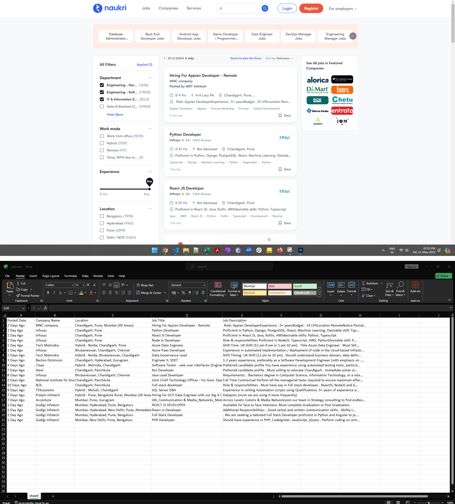

# Web Scraping for Tech Job Postings (Module #6 Node.js Day 4 Homework)


This assignment is designed to scrape products data from [naukri.com](https://www.naukri.com/it-jobs?src=gnbjobs_homepage_srch) and store it into excel file (jobs.xlsx)
following information is being scraped:
+ Job Title
+ Company Name
+ Location
+ Posted Date
+ Job Description
 

## Objectives
+ learn how to scrape data using puppeteer
+ save scraped data into excel file (.xlsx) 

## How execute script on yorus local machine
```bash
node index.mjs
```

## OUTPUT
on Successfull operation, data shall be stored in `jobs.xlsx` file

## Tech. Stack Used:
+ [NodeJS](https://nodejs.org/en/)
+ [Puppeteer](https://www.npmjs.com/package/puppeteer)
+ [xlsx](https://www.npmjs.com/package/xlsx)

 
## Author
[Abhishek kumar](https://www.linkedin.com/in/alex21c/), ([Geekster](https://geekster.in/) MERN Stack FS-14 Batch)


  
  


